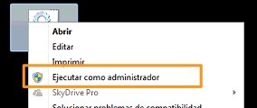

# Windows 7 & 10 HOME Data Science setup (Torus, Docker and Cookiecutter)

**This setup in opinionated. Please read the [disclaimer](#disclaimer) below**

I wanted to set up **Torus** on Windows 7 and Windows 10 Home and realized it was not as simple as I thought (at least compared to Linux and Mac).

**As a summary, Docker Desktop is not supported for Windows 7 and Windows 10 HOME, so you have to install Docker Toolbox**

After reading and testing I got a batch script to somehow automate the process. 

## What will this do?
1. Install chocolatey
2. Install python3 using chocolatey
3. Create a _Docker_ forlder in the folder where the script is
4. Install pip and cookiecutter
4. Download DockerTools from docker.com into _Docker_ folder
5. Open DockerTools.exe for you and wait until it is installed
6. Create Torus project

## Instructions

1. Download scripts/data-science-windows-7-and-10-HOME.cmd to a folder of your choice. I recommend your _Documents_ or _Desktop_ folder.
2. Right clic on the file and click on open as administrator

3. Follow the instructions.
4. Open **Docker Quickstart Terminal** and cd to the project folder inside folder you chose
5. From **Docker Quickstart Terminal** run ./start.sh
6. Once ready you will have a TORUS instance up and running. You can check by running `docker ps` in a cmd or terminal

## TO-DO
[ ] Fix script for Windows 10 Pro (or not HOME) to support WLS and Docker Desktop

## Disclaimer
I publish this in case others find it useful. Use it under your own risk. This script is opionated, meaning I chose the tools and paths I liked, which may be different from those you want. You are free to modify it according to your needs.